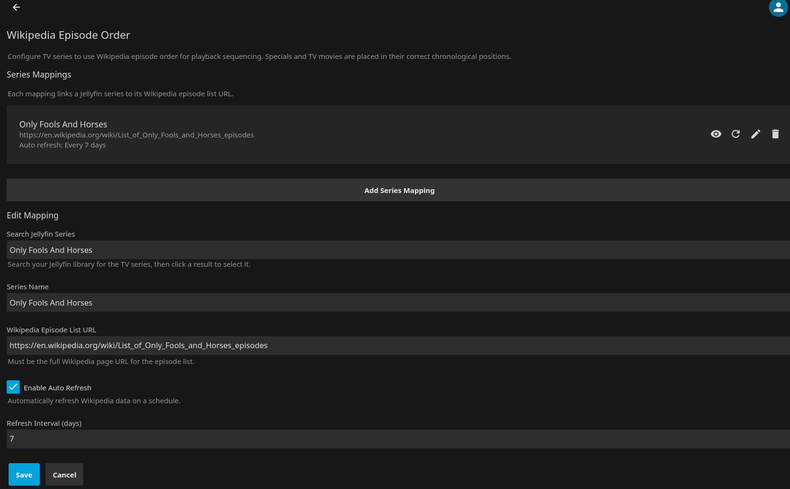
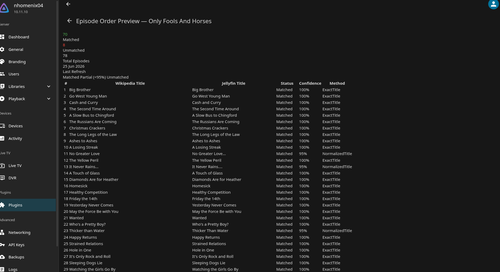
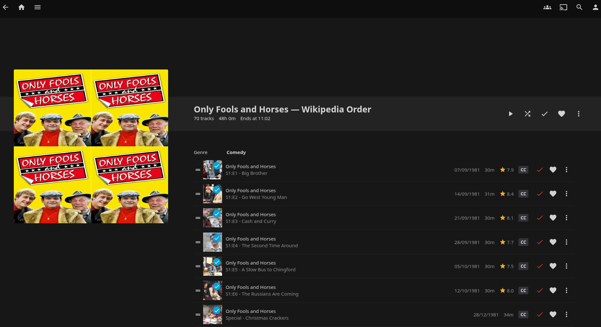

# Wikipedia Episode Order

A [Jellyfin](https://jellyfin.org) plugin that fetches Wikipedia episode list pages and matches episodes against your Jellyfin library to produce the correct viewing order, then creates a Jellyfin playlist for playback.

**Version:** 1.0.25.0  
**Author:** Neil Manfred — https://github.com/neilmanfredit  
**Licence:** CC BY-NC-ND 4.0 — non-commercial use only, no derivatives

---

## Installing via Jellyfin Plugin Repository (Recommended)

1. In Jellyfin, go to **Dashboard → Plugins → Catalogue**
2. Click **Manage Repositories**
3. Click the **+** button to add a new repository
4. Enter a name (e.g. `Wikipedia Episode Order`) and this URL: https://neilmanfredit.github.io/wikiepisodeorder-jellyfin-plugin/manifest.json
5. Click **Save**
6. Return to **Dashboard → Plugins → Catalogue** and search for **Wikipedia Episode Order**
7. Click **Install** and restart Jellyfin when prompted

---

## What it does

Wikipedia episode list pages encode the actual broadcast order of a TV series, including specials, Christmas episodes, TV movies, and reunion specials placed at their correct chronological positions. This plugin reads those pages, matches each episode against your Jellyfin library, and creates a playlist in that order so you can watch a series in the sequence it was originally broadcast.

Episodes not present in your Jellyfin library are excluded from the playlist. The playlist is named `{Series Name} — Wikipedia Order` and appears under Playlists in Jellyfin.

This is useful for series that bounce between specials and series and back again — a good example is [Only Fools and Horses](https://en.wikipedia.org/wiki/List_of_Only_Fools_and_Horses_episodes), which was used to build and test this plugin.

### Configuration

Add a series mapping by searching your Jellyfin library and pasting the Wikipedia episode list URL.



### Episode order preview

Before creating a playlist, the preview page shows every Wikipedia episode matched against your Jellyfin library, with confidence score and match method.



### Playlist in Jellyfin

Once created, the playlist appears under Playlists in Jellyfin with episodes in the correct broadcast order, including specials placed chronologically.



---

## Requirements

- Jellyfin 10.11.10 or later
- .NET 9 runtime (ships with Jellyfin 10.11.x — no separate installation required)

---

## Installation

1. Download `WikipediaEpisodeOrder-v1.0.25.tar.gz` from the [GitHub releases page](https://github.com/neilmanfredit/wikiepisodeorder-jellyfin-plugin/releases).

2. On the Jellyfin server, create the plugin folder:

   ```bash
   sudo mkdir -p "/var/lib/jellyfin/plugins/Wikipedia Episode Order_1.0.25.0"
   ```

3. Extract the tarball into that folder:

   ```bash
   sudo tar -xzf WikipediaEpisodeOrder-v1.0.25.tar.gz \
       -C "/var/lib/jellyfin/plugins/Wikipedia Episode Order_1.0.25.0"
   ```

4. Set ownership:

   ```bash
   sudo chown -R jellyfin:jellyfin "/var/lib/jellyfin/plugins/Wikipedia Episode Order_1.0.25.0"
   ```

5. Restart Jellyfin:

   ```bash
   sudo systemctl restart jellyfin
   ```

6. Verify: Dashboard → Plugins → Wikipedia Episode Order should show **Status: Active**.

---

## Usage

### Set up a series mapping

1. Go to **Dashboard → Plugins → Wikipedia Episode Order → Settings**.
2. Click **Add Series Mapping**.
3. Search for your TV series by name — this searches your Jellyfin library.
4. Paste the Wikipedia episode list URL, for example:  
   `https://en.wikipedia.org/wiki/List_of_Only_Fools_and_Horses_episodes`
5. Optionally enable **Auto Refresh** and set a refresh interval in days.
6. Click **Save**, then **Save Configuration**.

### Create the playlist

1. Click **Preview** on your mapping to see the matched episode order before committing.
2. Click **Refresh from Wikipedia** to fetch or update the episode data from Wikipedia.
3. Click **Create Playlist** to create the Jellyfin playlist in Wikipedia order.
4. Find the playlist in Jellyfin under **Playlists** — named `{Series Name} — Wikipedia Order`.
5. Play the playlist for correct episode ordering.

---

## Known limitations

- Episodes not in your Jellyfin library are excluded from the playlist.
- Wikipedia pages with heavily non-standard table formats may produce partial matches — check the Preview to confirm coverage before creating a playlist.
- This plugin targets Jellyfin 10.11.10. Earlier versions are not supported.

---

## Licence

Copyright © Neil Manfred. Licensed under the [Creative Commons Attribution-NonCommercial-NoDerivatives 4.0 International License](LICENSE). Commercial use and derivative works are not permitted.
